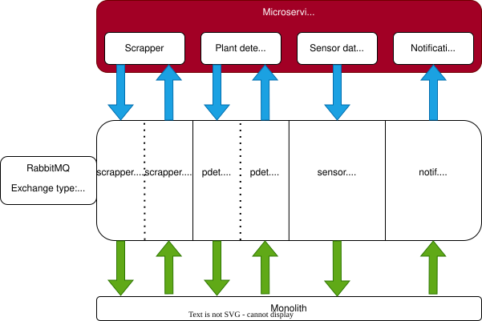

# RabbitMQ.

## 1. `definitions.json`

### Basics.

Purpose- creating users, queues, exchanger and configure it.

#### 1.1. Users and permissions.

For each publisher/subscriber we create its own user. List of users:

- Admin `admin`
- Monolith `monolith_svc`
- Scrapper `scrapper_svc`
- Sensor `sensor_svc`
- Notification `notification_svc`
- Plant Detection `pdet_svc`

**Permissions.**  
Located in `permissions` block of the file.  
Each of them has an access for reading/writing specific queues according to that scheme:  


Example:  
`sensor_svc` has an access for writing into `sensor.data.queue`, but cannot write or read any other.  
`monolith_svc` is the only one user that has an access for reading from `sensor.data.queue`.

#### 1.2. Exchanger.

```
{
      "name": "amq.topic",
      "vhost": "/", <- standart host for getting all the messages
      "type": "topic", <- type of exchanger. TOPIC- routing goes by routing keys.
      "durable": true, <- will be saved even after reload (saving on computer).
      "auto_delete": false,
      "arguments": {}
    }
```

#### 1.3. Queues.

Example:

```
    { "name": "scrapper.result.queue", <- name of the queue
    "vhost": "/",
    "durable": true,   <- saving messages on computer in order not to lose them.
    "auto_delete": false,
    "arguments": {
        "x-message-ttl" : 60000,  <- how many milliseconds message will store in queue
        "x-max-length": 100} <- max amount of messages in queue.
    }
```

#### 1.4. Bindings.

This block is used to bind exchanger to the queues.  
Example:

```
    { "source": "amq.topic",  <- our exchanger
    "vhost": "/",
    "destination": "scrapper.result.queue",  <- our queue
    "destination_type": "queue",
    "routing_key": "scrapper.result.#",  <- our routing key
    "arguments": {} },
```

## 2. `rabbitmq.conf`

#### 2.1. Loading.

```
management.load_definitions = /etc/rabbitmq/definitions.json <- allowing to load config from exact file.
```

#### 2.2. Logging.

```
log.console = true <- allows us to log in docker
log.console.level = info
```

#### 2.3. Optimization.

```
vm_memory_high_watermark.relative = 0.4 <- on memory usage of 40% of RabbitMQ limit it will slow down.
```

## 3. `docker-compose.yml`

```
version: '3.8'

services:
  rabbitmq:
    image: rabbitmq:3-management
    container_name: rabbitmq
    hostname: rabbit-node
    restart: always
    ports:
      - "5672:5672"   # AMQP
      - "15672:15672" # Management UI
    volumes:
      - ./rabbitmq.conf:/etc/rabbitmq/rabbitmq.conf:ro <- config file
      - ./definitions.json:/etc/rabbitmq/definitions.json:ro <- config file
      - rabbitmq_data:/var/lib/rabbitmq <- storing path
    networks:
      - rabbit_net
    deploy:
      resources:
        limits:
          memory: 1gb <- Memory limit

networks:
  rabbit_net:
    driver: bridge

volumes:
  rabbitmq_data:
```

## 4. Usage.

### 4.1. Start

`docker-compose up`

### 4.2. Stop

`docker-compose down` (add -v flag at the end to erase previous data).

### 4.3. Temp passwords:

`admin`: root  
`all-other-users`: alesivantamara
